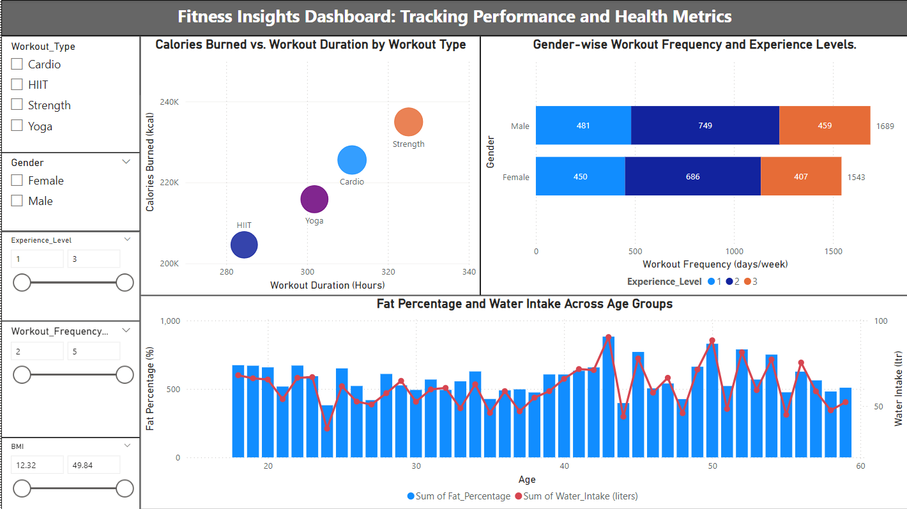
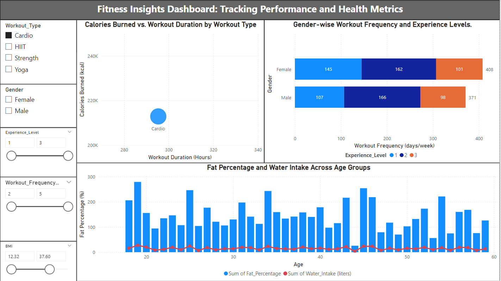
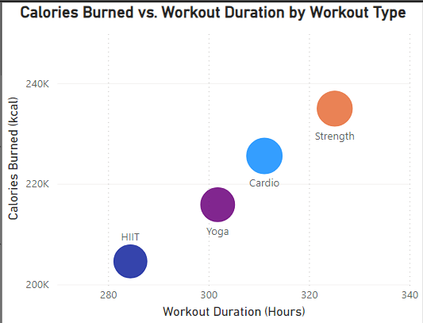
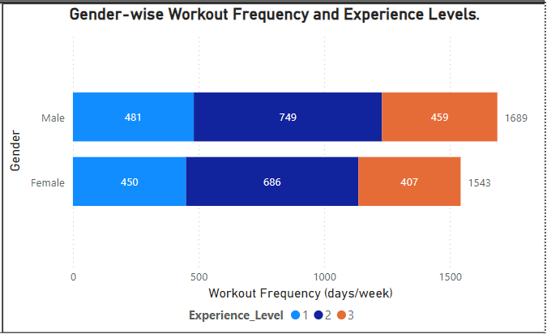
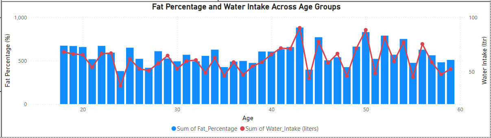

# Fitness Insight Dashboard

This Power BI dashboard provides insights into workout performance, health metrics, and demographic trends. It helps users make data-driven decisions to improve fitness and overall health.

---

## Dashboard Overview

---

## Filters (Slicers)

The dashboard includes interactive filters for:
- Workout Type  
- Gender  
- Experience Level  
- Workout Frequency  
- BMI  

---

## Key Visualizations

### Calories Burned vs Workout Duration

- Shows the relationship between workout duration and calories burned  
- Compares Cardio, HIIT, Strength, and Yoga  
- Helps identify effective workout types  

---

### Gender-wise Workout Frequency and Experience Levels

- Compares workout frequency between males and females  
- Categorized by experience level (Beginner, Intermediate, Advanced)  

---

### Fat Percentage and Water Intake Across Age Groups

- Displays fat percentage and water intake across different age groups  
- Helps understand health trends  

---

## Tools Used

- Power BI  
- Data Cleaning and Transformation  
- Data Analysis  

---

## Project Structure
Fitness-Insight-Dashboard/
│
├── Fitness Insight Dashboard POWER BI.pbix
├── Dashboard.png
├── CaloriesBurnt_vs_WorkoutDurByType.png
├── Gender-Workout_Freq_and_Exp_Levels.png
├── Fat_Per_Water_Intake_Across_AgeGroup.png
├── Slicers.png
└── README.md

---

## Key Insights

- Strength workouts burn more calories for longer durations  
- HIIT is effective for shorter, high-intensity sessions  
- Workout patterns vary across gender and experience levels  
- Water intake is linked to better fat management  
- Age impacts fitness and hydration trends  

---

## How to Use

1. Download the `.pbix` file  
2. Open it in Power BI Desktop  
3. Use filters to explore the dashboard  

---

## Author

Vipul Gupta  
B.Tech CSE Student  
